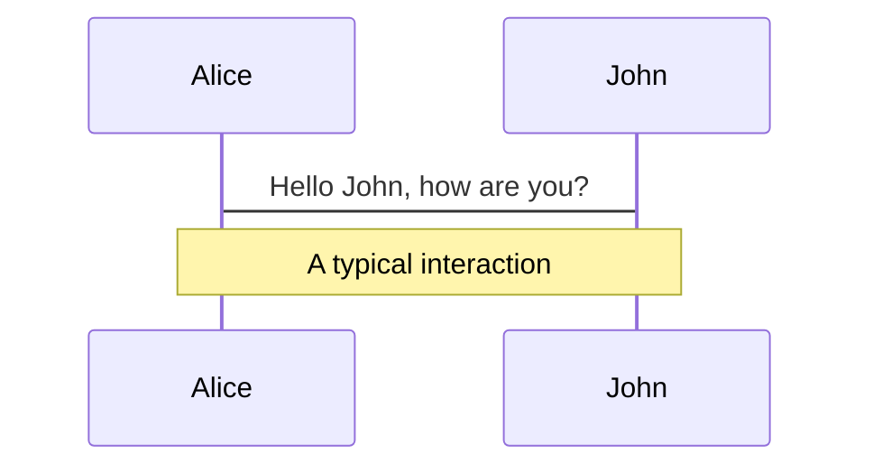
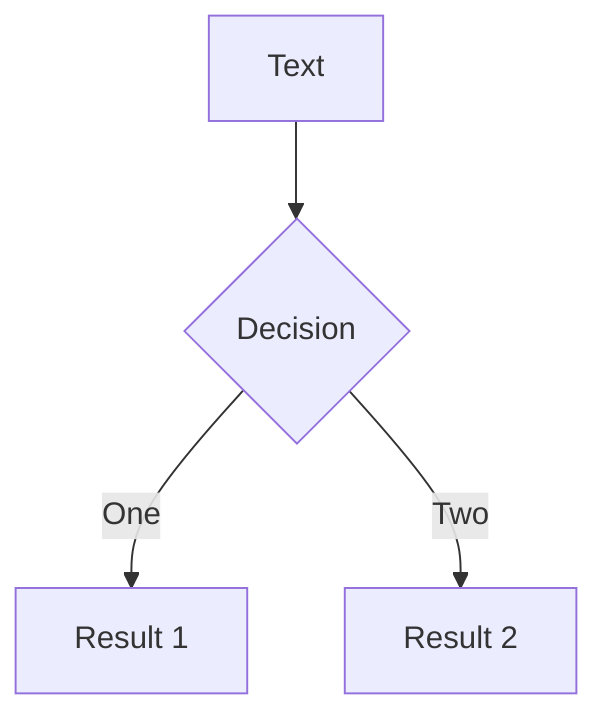
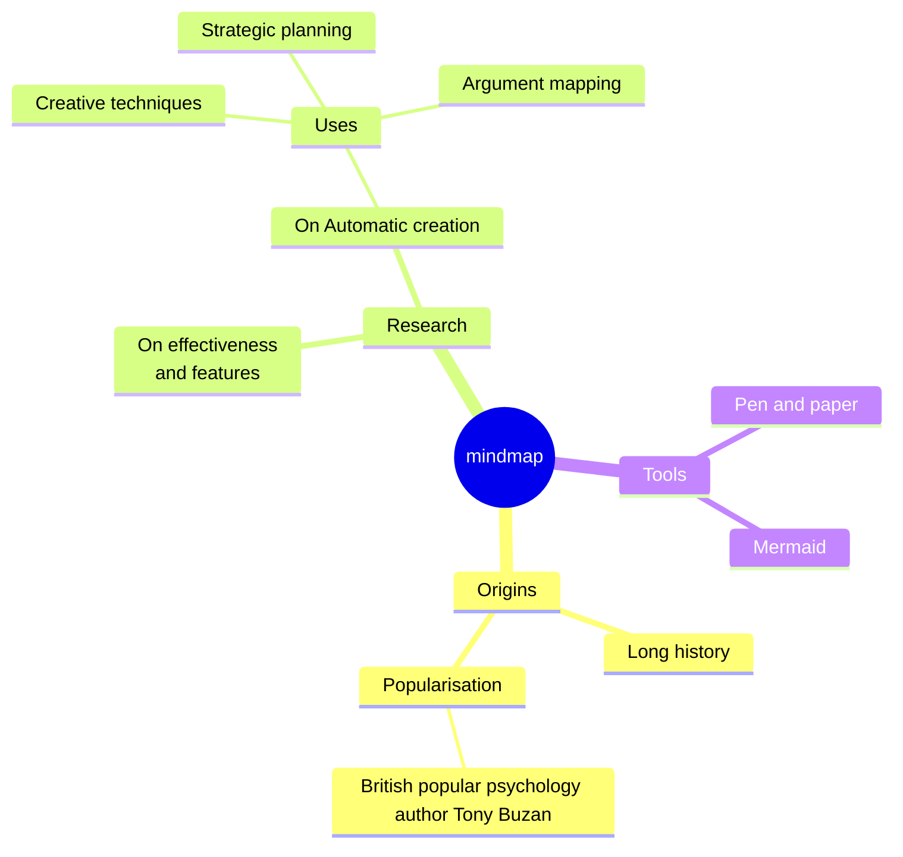
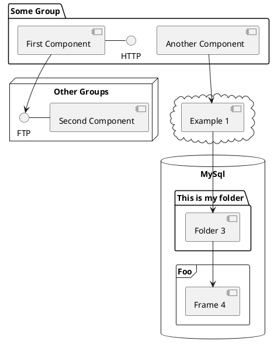

---
# try also 'default' to start simple
theme: apple-basic
# random image from a curated Unsplash collection by Anthony
# like them? see https://unsplash.com/collections/94734566/slidev
#background: https://cover.sli.dev
# some information about your slides, markdown enabled
title: Welcome to Slidev
info: |
  ## Slidev Starter Template
  Presentation slides for developers.

  Learn more at [Sli.dev](https://sli.dev)
# apply any unocss classes to the current slide
class: text-center
# https://sli.dev/custom/highlighters.html
highlighter: shiki
# https://sli.dev/guide/drawing
drawings:
  persist: false
# slide transition: https://sli.dev/guide/animations#slide-transitions
transition: slide-left
# enable MDC Syntax: https://sli.dev/guide/syntax#mdc-syntax
mdc: true

layout: intro
---

# Counter cache bottlenecks? Unleash SQL Views! 

---
transition: fade-out
---

# Ever needed to show a count of items in a related collection?

````md magic-move
```ruby
class Exam
  has_many :students
end

class Student
  belongs_to :exam
end
```

```ruby
class Exam
  # students_count  :integer
  
  has_many :students, counter_cache: true
end

class Student
  belongs_to :exam
end
```
````

-> Counter_cache

---

# What if you need complex counters?

````md magic-move

```ruby
class Exam
  has_many :students
  end

class Student
  belongs_to :exam
end
```

```ruby {9|4,9}
class Exam
  has_many :students
  
  # number_of_student_who_have_finished_the_exam ?
end

class Student
  belongs_to :exam
  enum status: { not_started: 0, started: 1, finished: 2}
end
```

```ruby {2-4,11|all}
class Exam
  # students_not_started_count :integer
  # students_started_count     :integer
  # students_finished_count    :integer  

  has_many :students
end

class Student
  belongs_to :exam
  counter_culture :exam, column_name: -> (model) {"students_#{model.status}_count"}
  
  enum status: { not_started: 0, started: 1, finished: 2}
end
```
````

::v-click{at=3}
 `counter_culture` gem
::

---
layout: statement
---

# Dorian becker

---

# What if the counter is not dependant on an attribute?
````md magic-move {lines: true}
```ruby
class Exam
  has_many :sessions
end

class Session
  #  start_at  :datetime
  #  end_at    :datetime
  
  belongs_to :exam
end
```
```ruby {11-12}
class Exam
  has_many :sessions
end

class Session
  #  start_at  :datetime
  #  end_at    :datetime
  
  belongs_to :exam

  scope :open, 
        -> { where("start_at <= ? AND end_at >= ?", Time.zone.now, Time.zone.now) }
end
```

```ruby {3,11-13}
class Exam
  has_many :sessions
  # open_sessions_count ?
end

class Session
  #  start_at  :datetime
  #  end_at    :datetime
  
  belongs_to :exam

  scope :open, 
        -> { where("start_at <= ? AND end_at >= ?", Time.zone.now, Time.zone.now) }
end
```
````

---

# Solutions
# Scope with subquery

---

# SQL Views
## What is it?

A SQL View is a virtual table based on the result of an SQL statement.

```sql
CREATE VIEW view_name AS
SELECT column1, column2, ...
FROM table_name
WHERE condition;
```

---

# SQL Views
## Real example

````md magic-move {lines: true}
```sql
SELECT exams.id as id,
   (
      SELECT COUNT(*)
      FROM students
      AND students.exam_id = exams.id
   ) as students_count
FROM exams

```

```sql
SELECT exams.id as id,
   (
      SELECT COUNT(CASE WHEN start_at <= NOW() AND (end_at >= NOW() OR end_at IS NULL) THEN 1 END) AS open_count,
      FROM sessions
      AND sessions.exam_id = exams.id
   ) as open_sessions_count
FROM exams

```


```sql {1-5|6-12|13-19}
students_cte AS (
  SELECT students.exam_id, COUNT(*) AS count
  FROM students
  GROUP BY students.exam_id
),
sessions_cte AS (
  SELECT
    exam_id,
    COUNT(CASE WHEN start_at <= NOW() AND (end_at >= NOW() OR end_at IS NULL) THEN 1 END) AS open_count,
  FROM sessions
  GROUP BY exam_id
)
SELECT
  exams.id as id,
  coalesce(scores_cte.count, 0) as scores_count,
  coalesce(sessions_cte.open_count, 0) as open_sessions_count,
FROM exams
LEFT JOIN students_cte ON students_cte.exam_id = exams.id
LEFT JOIN sessions_cte ON sessions_cte.exam_id = exams.id

```

```sql {9,11,12,19,21,22}
students_cte AS (
  SELECT students.exam_id, COUNT(*) AS count
  FROM students
  GROUP BY students.exam_id
),
sessions_cte AS (
  SELECT
    exam_id,
    COUNT(*) AS total_count,
    COUNT(CASE WHEN start_at <= NOW() AND (end_at >= NOW() OR end_at IS NULL) THEN 1 END) AS open_count,
    COUNT(CASE WHEN start_at > NOW() OR (end_at < NOW() AND end_at IS NOT NULL) THEN 1 END) AS closed_count,
    COUNT(CASE WHEN end_at < NOW() AND end_at IS NOT NULL THEN 1 END) AS ended_count
  FROM sessions
  GROUP BY exam_id
)
SELECT
  exams.id as id,
  coalesce(scores_cte.count, 0) as scores_count,
  coalesce(sessions_cte.total_count, 0) as sessions_count,
  coalesce(sessions_cte.open_count, 0) as open_sessions_count,
  coalesce(sessions_cte.closed_count, 0) as closed_sessions_count,
  coalesce(sessions_cte.ended_count, 0) as ended_sessions_count
FROM exams
LEFT JOIN students_cte ON students_cte.exam_id = exams.id
LEFT JOIN sessions_cte ON sessions_cte.exam_id = exams.id

```
````

---

# SQL Views
## How to create a SQL View in Rails?

2 Solutions:
::v-clicks
- Move from `schema.rb` to `structure.sql` and write the SQL View in migration files
- <span v-mark="{ at: 3, color: 'red', type: 'circle' }">
    Use <code>scenic</code> gem
  </span> + files dedicated to SQL Views migration
::

---

# Scenic gem

```bash {1|7|6|3}
rails g scenic:model exam_stats
   invoke  active_record
   create    app/models/exam_stats.rb
   invoke    rspec
    create      spec/models/exam_stats_spec.rbs
   create  db/views/exam_stats_v01.sql
   create  db/migrate/[TIMESTAMP]_create_exam_stats_view.rb
```

<div v-click="1" >
```ruby
# db/migrate/[TIMESTAMP]_create_exam_stats_view.rb
class CreateExamStatsView < ActiveRecord::Migration[7.1]
  def change
    create_view :exam_stats
  end
end
```
</div>


<div v-click="2" >
```sql
-- db/views/exam_stats_v01.sql
students_cte AS (
  SELECT students.exam_id, COUNT(*) AS count
  FROM students
  GROUP BY students.exam_id
),
-- ...
```
</div>

---

# Model associated with the SQL View

```ruby
# app/models/exam_stats.rb

# == Schema Information
#
# Table name: exam_stats
#
#  id                    :integer          primary key
#  closed_sessions_count :bigint
#  ended_sessions_count  :bigint
#  open_sessions_count   :bigint
#  sessions_count        :bigint
#  students_count        :bigint

class ExamStats < ApplicationRecord

  self.primary_key = :id

  belongs_to :exam, inverse_of: :stat, foreign_key: :id

  def readonly? = true
end
```

---

# Real example old

````md magic-move {lines: true}
```sql
SELECT exams.id as id,
   (
      SELECT COUNT(*)
      FROM students
      AND students.exam_id = exams.id
   ) as students_count
FROM exams

```

```sql
SELECT exams.id as id,
   (
      SELECT COUNT(CASE WHEN start_at <= NOW() AND (end_at >= NOW() OR end_at IS NULL) THEN 1 END) AS open_count,
      FROM sessions
      AND sessions.exam_id = exams.id
   ) as open_sessions_count
FROM exams

```


```sql {1-5|6-15|16-30}
scores_cte AS (
  SELECT s.exam_id, COUNT(*) AS count
  FROM scores s
  GROUP BY s.exam_id
),
sessions_cte AS (
  SELECT
    exam_id,
    COUNT(*) AS total_count,
    COUNT(CASE WHEN start_at <= NOW() AND (end_at >= NOW() OR end_at IS NULL) THEN 1 END) AS open_count,
    COUNT(CASE WHEN start_at > NOW() OR (end_at < NOW() AND end_at IS NOT NULL) THEN 1 END) AS closed_count,
    COUNT(CASE WHEN end_at < NOW() AND end_at IS NOT NULL THEN 1 END) AS ended_count
  FROM sessions
  GROUP BY exam_id
)
SELECT
  exams.id as id,
  exams.id as exam_id,
  coalesce(scores_cte.count, 0) as scores_count,
  coalesce(sessions_cte.total_count, 0) as sessions_count,
  coalesce(sessions_cte.open_count, 0) as open_sessions_count,
  coalesce(sessions_cte.closed_count, 0) as closed_sessions_count,
  coalesce(sessions_cte.ended_count, 0) as ended_sessions_count
FROM exams
LEFT JOIN scores_cte ON scores_cte.exam_id = exams.id
LEFT JOIN sessions_cte ON sessions_cte.exam_id = exams.id

```

```sql
scores_cte AS (
  SELECT s.exam_id, COUNT(*) AS count
  FROM scores s
  WHERE s.deleted_at IS NULL
  GROUP BY s.exam_id
),
sessions_cte AS (
  SELECT
    exam_id,
    COUNT(*) AS total_count,
    COUNT(CASE WHEN start_at <= NOW() AND (end_at >= NOW() OR end_at IS NULL) THEN 1 END) AS open_count,
    COUNT(CASE WHEN start_at > NOW() OR (end_at < NOW() AND end_at IS NOT NULL) THEN 1 END) AS closed_count,
    COUNT(CASE WHEN end_at < NOW() AND end_at IS NOT NULL THEN 1 END) AS ended_count
  FROM sessions
  GROUP BY exam_id
)
SELECT
  exams.id as id,
  exams.id as exam_id,
  coalesce(scores_cte.count, 0) as scores_count,
  coalesce(sessions_cte.total_count, 0) as sessions_count,
  coalesce(sessions_cte.open_count, 0) as open_sessions_count,
  coalesce(sessions_cte.closed_count, 0) as closed_sessions_count,
  coalesce(sessions_cte.ended_count, 0) as ended_sessions_count
FROM exams
LEFT JOIN scores_cte ON scores_cte.exam_id = exams.id
LEFT JOIN sessions_cte ON sessions_cte.exam_id = exams.id

```

````

---


# Welcome to Slideveeeefffffff

Presentation slides for developers

<div class="pt-12">
  <span @click="$slidev.nav.next" class="px-2 py-1 rounded cursor-pointer" hover="bg-white bg-opacity-10">
    Press Space for next page <carbon:arrow-right class="inline"/>
  </span>
</div>

<div class="abs-br m-6 flex gap-2">
  <button @click="$slidev.nav.openInEditor()" title="Open in Editor" class="text-xl slidev-icon-btn opacity-50 !border-none !hover:text-white">
    <carbon:edit />
  </button>
  <a href="https://github.com/slidevjs/slidev" target="_blank" alt="GitHub" title="Open in GitHub"
    class="text-xl slidev-icon-btn opacity-50 !border-none !hover:text-white">
    <carbon-logo-github />
  </a>
</div>

<!--
The last comment block of each slide will be treated as slide notes. It will be visible and editable in Presenter Mode along with the slide. [Read more in the docs](https://sli.dev/guide/syntax.html#notes)
-->

---
transition: fade-out
---

# What is Slidev?

Slidev is a slides maker and presenter designed for developers, consist of the following features

- 📝 **Text-based** - focus on the content with Markdown, and then style them later
- 🎨 **Themable** - theme can be shared and used with npm packages
- 🧑‍💻 **Developer Friendly** - code highlighting, live coding with autocompletion
- 🤹 **Interactive** - embedding Vue components to enhance your expressions
- 🎥 **Recording** - built-in recording and camera view
- 📤 **Portable** - export into PDF, PPTX, PNGs, or even a hostable SPA
- 🛠 **Hackable** - anything possible on a webpage

<br>
<br>

Read more about [Why Slidev?](https://sli.dev/guide/why)

<!--
You can have `style` tag in markdown to override the style for the current page.
Learn more: https://sli.dev/guide/syntax#embedded-styles
-->

<style>
h1 {
  background-color: #2B90B6;
  background-image: linear-gradient(45deg, #4EC5D4 10%, #146b8c 20%);
  background-size: 100%;
  -webkit-background-clip: text;
  -moz-background-clip: text;
  -webkit-text-fill-color: transparent;
  -moz-text-fill-color: transparent;
}
</style>

<!--
Here is another comment.
-->

---
transition: slide-up
level: 2
---

# Navigation

Hover on the bottom-left corner to see the navigation's controls panel, [learn more](https://sli.dev/guide/navigation.html)

## Keyboard Shortcuts

|     |     |
| --- | --- |
| <kbd>right</kbd> / <kbd>space</kbd>| next animation or slide |
| <kbd>left</kbd>  / <kbd>shift</kbd><kbd>space</kbd> | previous animation or slide |
| <kbd>up</kbd> | previous slide |
| <kbd>down</kbd> | next slide |

<!-- https://sli.dev/guide/animations.html#click-animations -->

<p v-after class="absolute bottom-23 left-45 opacity-30 transform -rotate-10">Here!</p>

---
layout: two-cols
layoutClass: gap-16
---

# Table of contents

You can use the `Toc` component to generate a table of contents for your slides:

```html
<Toc minDepth="1" maxDepth="1"></Toc>
```

The title will be inferred from your slide content, or you can override it with `title` and `level` in your frontmatter.

::right::

<Toc v-click minDepth="1" maxDepth="2"></Toc>

---
layout: image-right
image: https://cover.sli.dev
---

# Code

Use code snippets and get the highlighting directly, and even types hover![^1]

```ts {all|5|7|7-8|10|all} twoslash
// TwoSlash enables TypeScript hover information
// and errors in markdown code blocks
// More at https://shiki.style/packages/twoslash

import { computed, ref } from 'vue'

const count = ref(0)
const doubled = computed(() => count.value * 2)

doubled.value = 2
```

<arrow v-click="[4, 5]" x1="350" y1="310" x2="195" y2="334" color="#953" width="2" arrowSize="1" />

<!-- This allow you to embed external code blocks -->
<<< @/snippets/external.ts#snippet

<!-- Footer -->
[^1]: [Learn More](https://sli.dev/guide/syntax.html#line-highlighting)

<!-- Inline style -->
<style>
.footnotes-sep {
  @apply mt-5 opacity-10;
}
.footnotes {
  @apply text-sm opacity-75;
}
.footnote-backref {
  display: none;
}
</style>

<!--
Notes can also sync with clicks

[click] This will be highlighted after the first click

[click] Highlighted with `count = ref(0)`

[click:3] Last click (skip two clicks)
-->

---
level: 2
---

# Shiki Magic Move

Powered by [shiki-magic-move](https://shiki-magic-move.netlify.app/), Slidev supports animations across multiple code snippets.

Add multiple code blocks and wrap them with <code>````md magic-move</code> (four backticks) to enable the magic move. For example:

````md magic-move {lines: true}
```ts {*|2|*}
// step 1
const author = reactive({
  name: 'John Doe',
  books: [
    'Vue 2 - Advanced Guide',
    'Vue 3 - Basic Guide',
    'Vue 4 - The Mystery'
  ]
})
```

```ts {*|1-2|3-4|3-4,8}
// step 2
export default {
  data() {
    return {
      author: {
        name: 'John Doe',
        books: [
          'Vue 2 - Advanced Guide',
          'Vue 3 - Basic Guide',
          'Vue 4 - The Mystery'
        ]
      }
    }
  }
}
```

```ts
// step 3
export default {
  data: () => ({
    author: {
      name: 'John Doe',
      books: [
        'Vue 2 - Advanced Guide',
        'Vue 3 - Basic Guide',
        'Vue 4 - The Mystery'
      ]
    }
  })
}
```

Non-code blocks are ignored.

```vue
<!-- step 4 -->
<script setup>
const author = {
  name: 'John Doe',
  books: [
    'Vue 2 - Advanced Guide',
    'Vue 3 - Basic Guide',
    'Vue 4 - The Mystery'
  ]
}
</script>
```
````

---

# Components

<div grid="~ cols-2 gap-4">
<div>

You can use Vue components directly inside your slides.

We have provided a few built-in components like `<Tweet/>` and `<Youtube/>` that you can use directly. And adding your custom components is also super easy.

```html
<Counter :count="10" />
```

<!-- ./components/Counter.vue -->
<Counter :count="10" m="t-4" />

Check out [the guides](https://sli.dev/builtin/components.html) for more.

</div>
<div>

```html
<Tweet id="1390115482657726468" />
```

<Tweet id="1390115482657726468" scale="0.65" />

</div>
</div>

<!--
Presenter note with **bold**, *italic*, and ~~striked~~ text.

Also, HTML elements are valid:
<div class="flex w-full">
  <span style="flex-grow: 1;">Left content</span>
  <span>Right content</span>
</div>
-->

---
class: px-20
---

# Themes

Slidev comes with powerful theming support. Themes can provide styles, layouts, components, or even configurations for tools. Switching between themes by just **one edit** in your frontmatter:

<div grid="~ cols-2 gap-2" m="t-2">

```yaml
---
theme: default
---
```

```yaml
---
theme: seriph
---
```


</div>

Read more about [How to use a theme](https://sli.dev/themes/use.html) and
check out the [Awesome Themes Gallery](https://sli.dev/themes/gallery.html).

---

# Clicks Animations

You can add `v-click` to elements to add a click animation.

<div v-click>

This shows up when you click the slide:

```html
<div v-click>This shows up when you click the slide.</div>
```

</div>

<br>

<v-click>

The <span v-mark.red="3"><code>v-mark</code> directive</span>
also allows you to add
<span v-mark.circle.orange="4">inline marks</span>
, powered by [Rough Notation](https://roughnotation.com/):

```html
<span v-mark.underline.orange>inline markers</span>
```

</v-click>

<div mt-20 v-click>

[Learn More](https://sli.dev/guide/animations#click-animations)

</div>

---

# Motions

Motion animations are powered by [@vueuse/motion](https://motion.vueuse.org/), triggered by `v-motion` directive.

```html
<div
  v-motion
  :initial="{ x: -80 }"
  :enter="{ x: 0 }"
  :click-3="{ x: 80 }"
  :leave="{ x: 1000 }"
>
  Slidev
</div>
```

<div class="w-60 relative">
  <div class="relative w-40 h-40">
    
    
    
  </div>

  <div
    class="text-5xl absolute top-14 left-40 text-[#2B90B6] -z-1"
    v-motion
    :initial="{ x: -80, opacity: 0}"
    :enter="{ x: 0, opacity: 1, transition: { delay: 2000, duration: 1000 } }">
    Slidev
  </div>
</div>

<!-- vue script setup scripts can be directly used in markdown, and will only affects current page -->
<script setup lang="ts">
const final = {
  x: 0,
  y: 0,
  rotate: 0,
  scale: 1,
  transition: {
    type: 'spring',
    damping: 10,
    stiffness: 20,
    mass: 2
  }
}
</script>

<div
  v-motion
  :initial="{ x:35, y: 30, opacity: 0}"
  :enter="{ y: 0, opacity: 1, transition: { delay: 3500 } }">

[Learn More](https://sli.dev/guide/animations.html#motion)

</div>

---

# LaTeX

LaTeX is supported out-of-box powered by [KaTeX](https://katex.org/).

<br>

Inline $\sqrt{3x-1}+(1+x)^2$

Block
$$ {1|3|all}
\begin{array}{c}

\nabla \times \vec{\mathbf{B}} -\, \frac1c\, \frac{\partial\vec{\mathbf{E}}}{\partial t} &
= \frac{4\pi}{c}\vec{\mathbf{j}}    \nabla \cdot \vec{\mathbf{E}} & = 4 \pi \rho \\

\nabla \times \vec{\mathbf{E}}\, +\, \frac1c\, \frac{\partial\vec{\mathbf{B}}}{\partial t} & = \vec{\mathbf{0}} \\

\nabla \cdot \vec{\mathbf{B}} & = 0

\end{array}
$$

<br>

[Learn more](https://sli.dev/guide/syntax#latex)

---

# Diagrams

You can create diagrams / graphs from textual descriptions, directly in your Markdown.

<div class="grid grid-cols-4 gap-5 pt-4 -mb-6">









</div>

[Learn More](https://sli.dev/guide/syntax.html#diagrams)

---
foo: bar
dragPos:
  square: 762,57,167,_,-16
---

# Draggable Elements

Double-click on the draggable elements to edit their positions.

<br>

###### Directive Usage

```md

```

<br>

###### Component Usage

```md
<v-drag text-3xl>
  <carbon:arrow-up />
  Use the `v-drag` component to have a draggable container!
</v-drag>
```

<v-drag pos="663,206,261,_,-14">
  <div text-center text-3xl border border-main rounded>
    Double-click me!
  </div>
</v-drag>


###### Draggable Arrow

```md
<v-drag-arrow two-way />
```

<v-drag-arrow pos="67,452,253,46" two-way op70 />

---
src: ./pages/multiple-entries.md
hide: false
---

---

ddfdfdf# Monaco Editorffff  

Slidev provides built-in Monaco Editor support.

Add `{monaco}` to the code block to turn it into an editor:

```ts {monaco}
import { ref } from 'vue'
import { emptyArray } from './external'

const arr = ref(emptyArray(10))
```

Use `{monaco-run}` to create an editor that can execute the code directly in the slide:

```ts {monaco-run}
import { version } from 'vue'
import { emptyArray, sayHello } from './external'

sayHello()
console.log(`vue ${version}`)
console.log(emptyArray<number>(10).reduce(fib => [...fib, fib.at(-1)! + fib.at(-2)!], [1, 1]))
```

---
layout: center
class: text-center
---

# Learn More

[Documentations](https://sli.dev) · [GitHub](https://github.com/slidevjs/slidev) · [Showcases](https://sli.dev/showcases.html)
